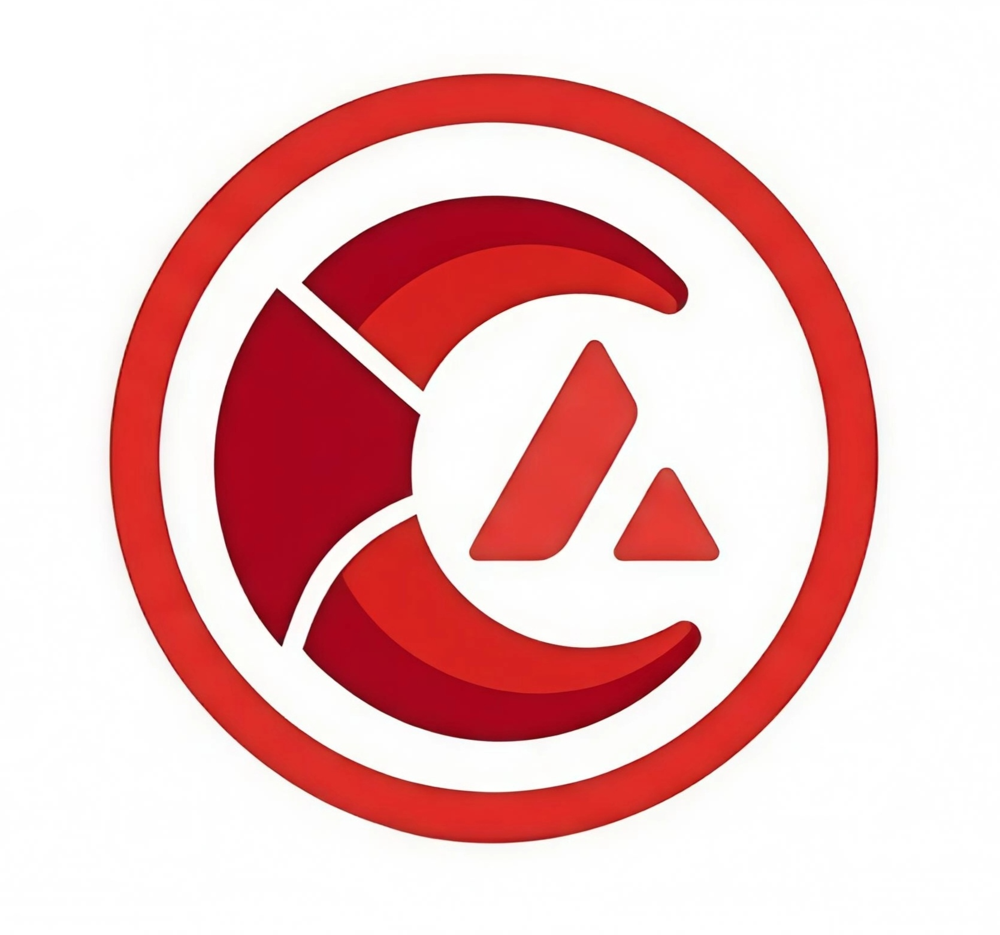

<p align="center">
  
</p>

<h1 align="center">ClawVax Protocol</h1>

<p align="center">
  A high-performance dApp ecosystem built for speed and security, <strong>powered by Avalanche (AVAX)</strong>.
</p>
https://arena.social/Clawvax_
https://x.com/Clawvax_

<p align="center">
  
  
  
</p>
## 📜 Table of Contents

- [About](#about)
- [Ecosystem](#ecosystem)
- [Getting Started](#getting-started)
- [Prerequisites](#prerequisites)
- [Installation](#installation)
- [Core Technology](#core-technology)
- [Branding Assets](#branding-assets)
- [Contributing](#contributing)
- [License](#license)

## 📖 About

**ClawVax Protocol** is a novel blockchain layer (subnet) designed specifically to address the scalability and efficiency bottlenecks of current decentralized applications. By leveraging the unique consensus mechanism of Avalanche, ClawVax provides near-instant finality and extremely low transaction costs.

Our mission is to bridge the gap between institutional-grade security and consumer-grade usability.

### Key Features

- **Blazing Fast Consensus:** Derived from Avalanche's unique protocol.
- **Horizontal Scalability:** Support for custom Subnets to isolate traffic.
- **AVAX Interoperability:** Native cross-chain assets and messaging with the Avalanche C-Chain.
- **Secure by Design:** Built on proven Solidity and Rust smart contract standards.

## 🏗️ Ecosystem

The ClawVax ecosystem consists of multiple core components, all currently in active development:

1. **ClawVax Core:** The primary layer for dApp execution.
2. **ClawVax SDK:** Tools and libraries for developers to build dApps easily.
3. **ClawLink Bridge:** Secure bridge mechanism to move assets between ClawVax and Avalanche C-Chain.

## 🚀 Getting Started

*Note: The project is currently in the **Development** phase. Documentation is subject to change.*

### Prerequisites

You will need the following tools installed:

- [Node.js](https://nodejs.org/) (v16.x or later)
- [NPM](https://www.npmjs.com/) (v8.x or later)
- [AVAX CLI](https://github.com/ava-labs/avalanche-cli)

### Installation

Clone the repository and install dependencies (placeholder command):

```bash
git clone [https://github.com/YourUsername/ClawVax-Protocol.git](https://github.com/YourUsername/ClawVax-Protocol.git)
cd ClawVax-Protocol
npm install

